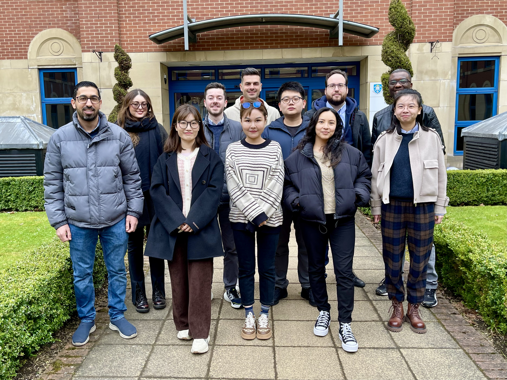



 
<figure>
  
  <figcaption>Mar 2023</figcaption>
</figure>

### Research Staff

* [Samuel Mensah](https://scholar.google.com/citations?user=tqChiOoAAAAJ&hl) 
* [Cass Zhao](https://www.sheffield.ac.uk/is/people/phd-researchers/cass-zhixue-zhao)

### PhD Students

* [Ahmed Alajrami](https://aajrami.github.io/)
* [Constantinos Karouzos](https://ckarouzos.github.io/)
* [Wenzhe Li](https://scholar.google.com/citations?user=ixVc4s8AAAAJ) 
* [Katerina Margatina](https://katerinamargatina.github.io/) 
* [Danae Sanchez Villegas](https://danaesavi.github.io/)
* Peter Vickers (co-supervised with [Loic Barrault](https://loicbarrault.github.io/))
* Miles Williams
* [Huiyin Xue](https://twitter.com/HuiyinXue)
* Manos Zaranis (co-supervised with [Nafise Sadat Moosavi](https://ns-moosavi.github.io/))

<!-- ### Interns -->

### Past Members and Visitors

* [Mali Jin](https://scholar.google.com/citations?user=Br8h1WIAAAAJ) (PhD student, 2019-23) -> Research Associate, University of Sheffield
* [Yida Mu](https://www.sheffield.ac.uk/dcs/people/research-staff/yida-mu-0) (PhD student, 2019-23) -> Research Associate, University of Sheffield
* Shakshi Sarma (Visiting PhD student from University of Tartu, Estonia, 2023)
* [George Chrysostomou](https://scholar.google.com/citations?user=t3eShIkAAAAJ&hl) (PhD student, 2019-22) -> Research Scientist, AstraZeneca
* Xiao Ao (MSc student - intern, 2021)
* Marina Fomicheva (Research Associate, 2019-21) -> Director of Research, context.ai
* Hardy (PhD student, co-supervised with [Andreas Vlachos](https://andreasvlachos.github.io/), 2019-21)
* Tulika Bose (Visiting PhD student from LORIA-INRIA, 2021)
* [Atsuki Yamaguchi](https://gucci-j.github.io/about/) (Intern, 2020-21) -> Research Engineer, Hitachi
* Areej Alokaili (PhD student, co-supervised with [Mark Stevenson](https://staffwww.dcs.shef.ac.uk/people/M.Stevenson/bio.html), 2018-21) -> Assistant Professor, King Saud University, Saudi Arabia
* [Ilias Chalkidis](https://iliaschalkidis.github.io/) (PhD student, co-supervised with [Ion Androutsopoulos](http://www2.aueb.gr/users/ion//), 2018-21) -> Research Associate, Coastal NLP, University of Copenhagen, Denmark
* [Fred Blain](https://fredblain.org/) (Research Associate, 2019-20) -> Lecturer, University of Wolverhampton, UK
* [Twin Karmakharm](https://www.twin.uk.com/) (Research Engineer, 2019)
* [Antonis Maronikolakis](https://antmarakis.github.io/)  (Intern, 2019) -> PhD student, Schütze Lab, LMU Munich, Germany

### Past Group Photos

[Feb 2022](../files/group_20220202.jpg)

